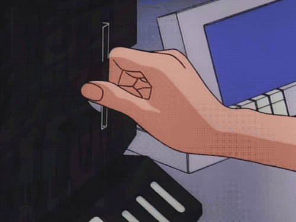

<h1 align="center">Hi, I'm Alexander Bukhov! </h1>
 
<picture> </picture>
 
<h3>About me</h3>
 

- A computer science student
- Interested in understanding complex things
- In the future I will definitely become a cool programmer and invent a lot of incredible things 

 

## <b> Skills</b>
 

- **Languages**:
    
    
    
    
    

